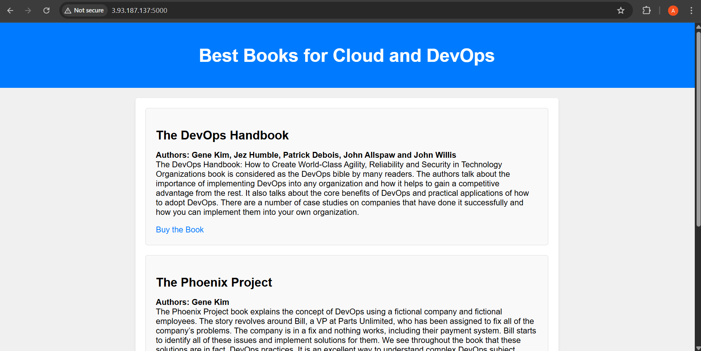

# Deploy Flask App on AWS with Terraform

This project demonstrates how to deploy a Python Flask web application on AWS EC2 using Terraform. It automates both infrastructure provisioning and application deployment.

---

## 📁 Project Structure


 ```
Deploy-Flask-App/
├── Application Deployment/
│   ├── main.tf
│   ├── variables.tf
│   ├── outputs.tf
│   ├── security-group.tf
│   ├── vpc.tf
│   ├── ec2.tf
│   ├── terraform.tfvars
│   └── (other Terraform files)
├── Flask Application/
│   ├── app.py
│   └── templates/
│       └── index.html
├── .gitignore
├── README.md
└── image.png

```
---

## 🚀 How It Works

1. **Infrastructure as Code:**  
   Uses Terraform to provision AWS resources (VPC, EC2, Security Groups, etc.).

2. **Automated App Deployment:**  
   Flask app is copied and started on the EC2 instance automatically.

3. **Modular Design:**  
   Each resource is defined in its own `.tf` file for clarity and maintainability.

---

## 🛠️ Getting Started

### Prerequisites

- AWS account & credentials
- [Terraform](https://www.terraform.io/downloads.html)
- [AWS CLI](https://aws.amazon.com/cli/)
- Python 3 & Flask (for local testing)

### Steps

1. **Clone the repository:**
   ```sh
   git clone https://github.com/yourusername/Deploy-Flask-App.git
   cd Deploy-Flask-App/Application\ Deployment
   ```

2. **Initialize Terraform:**
   ```sh
   terraform init
   ```

3. **Review and update variables in `terraform.tfvars` as needed.**

4. **Plan and apply:**
   ```sh
   terraform plan
   terraform apply -auto-approve
   ```

5. **Access your Flask app:**  
   Terraform will output the public IP or URL of your deployed app.

---

## 📚 Documentation

- [setup.md](setup.md) – Environment setup instructions
- [providers.md](providers.md) – Provider configuration
- [resources.md](resources.md) – Resource definitions
- [variables.md](variables.md) – Variable usage
- [outputs.md](outputs.md) – Output values
- [flask-app.md](flask-app.md) – Flask app details
- [deployment.md](deployment.md) – Deployment steps

---

## 🖼️ Screenshots

- Architecture diagram  
  

- App  
    <!-- Make sure Flaskapp.png is in the same repo folder or adjust the path -->

---

## 🤝 Contributing

Pull requests are welcome! For major changes, please open an issue first.

---

## 📄 License

[MIT](LICENSE) (add a LICENSE file if you wish)

---
